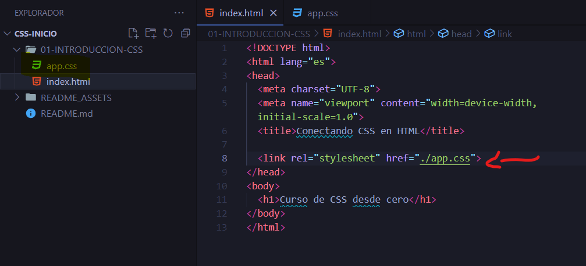
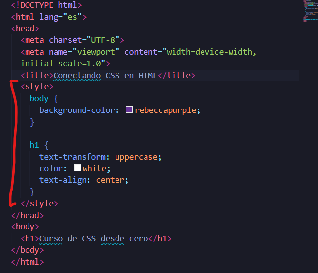
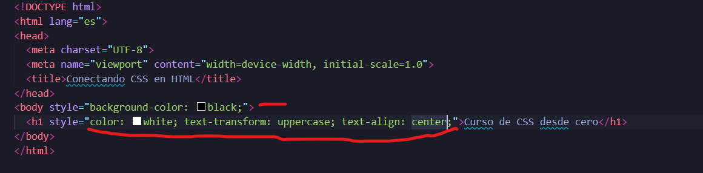
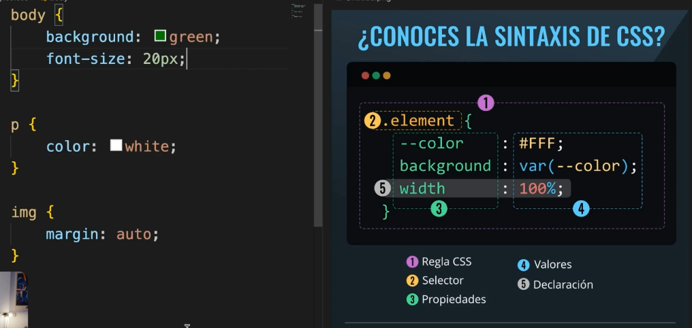
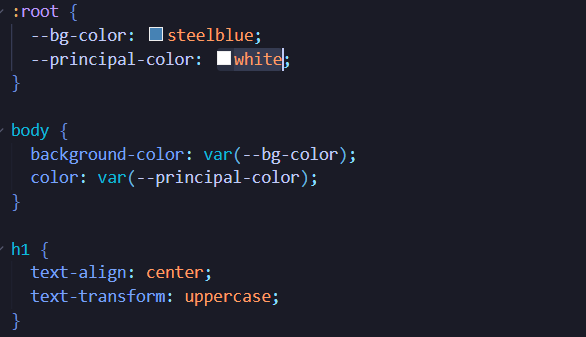
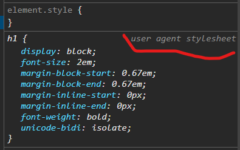

# CSS

## Introducción a CSS

Con **CSS** *(cascade style sheets)* podemos diseñar con código. 

### Historia de CSS
La web nació en 1991 con HTML y el protócolo HTTP. Con HTML estructuramos la información pero no podiamos diseñar, asi que en 1996 nace **CSS** y el navegador *IE3* es el primero en usar CSS.

* La primera recomendación fue en 1996 (Proyecto Monolito)
* La segunda recomendación fue en 1998 (Proyecto Monolito)
* La tercera recomendación fue en 2011 (Proyecto estructurado en módulos)


### Conectar CSS con HTML
Existen varias maneras de conectar código CSS en el HTML, como por ejemplo:

#### Archivos por separados (manera recomendada)
Se utiliza la etiqueta `<link></link>` para enlazar un archivo css con HTML


#### Con la etiqueta `<style></style>` dentro de HTML
Si se utiliza asi el **CSS**, no será reutilizable y por ende si lo necesitamos en otro documento HTML entonces tendremos a copia y pegar el mismo código.



#### Estilos en linea
Esta es la forma **NO RECOMENDADA** para hacer estilos CSS ya que de plano deja de ser reutilizable.

Solo se usan en la creación de correos electrónicos.


### Sintaxis de CSS



### Variables CSS
Las variables es una forma de reutilizar valores y es un concepto propio de la programación.

Con las variables CSS podemos reutilizar valores de manera dínamica.

Normalmente las variables **CSS** se usan en el pseudoclase `:root` porque es nivel más alto de un documento HTML, es incluso mayor que la etiqueta `html` y por eso todas las variables declarada en `:root` se pueden utilizar en toda la cascada.



## Selectores CSS
Los selectores definen a que elemento o elementos HTML le vamos a aplicar los estilos CSS.

Los *navegadores webs* ya tienen estilos predeterminados


### Selectores simples

#### Selectores de etiqueta
Agregamos estilos a etiquetas de HTML en específico como por ejemplo:
```
h1 {
  color: red;
}
```

Normalmente se usa este tipo de selectores para **resetear o normalizar** los estilos CSS

#### Selectores de clases
Estos tipos de selectores son los más usuados porque podemos reutilizar los estilos CSS

```
.color-blue {
  color: blue
}
```

**NOTAS:** Las clases no puede iniciar con un número

#### Selector de ID
Este selector solo afecta a un elemento HTML ya que los ID deben ser únicos por cada documento HTML

```
#title {
  text-transform: uppercase;
}
```

Normalmente *IDs* se usan mayormente con JavaScript y no con CSS.


### Selectores compuestos

#### Selectores agrupados
Los selectores agrupados combinan varios selectores y se le aplican el mismo estilo a más de un elemento HTML y se declaran asi:

```
.first-p,
.second-p {
  color: green;
}
```

#### Selectores combinados
Son similares a los **selectores agrupados** pero la diferencia es que se juntan, como por ejemplo:
```
.first-p.second-p {
  color: green;
}
```
En este selector se seleccionaran a todos los elementos que tenga la clase `first-p` y la clase `second-p` al mismo tiempo.

#### Selectores descendientes
Los selectores descendientes en CSS son una forma de especificar un estilo para un elemento que está anidado dentro de otro elemento específico.

 Los selectores descendientes se aplican a elementos que son descendientes directos o indirectos de otro elemento, no necesariamente hijos directos.
```
div p {
  color: green;
}
```
### Selectores de operador
Usan operadores para generar relaciones entre los elementos.

#### selector universal
Se usa el caracter `*` y es capaz se seleccionar todos los elementos HTML de nuestro documento:

```
* {
  color: red;
}
```
Normalmente el selector unirversal se usa para resetar los margin y padding de todos los elementos HTML

#### Selector hijo directo
Se usa el caracte `> ` y solo selecciona los hijos directos de un selector padre

```
article > p {
  backgroun-color: yellow;
}
```
> Selecciona a la etiqueta p que es hijo directo de un article

#### Selector hermano directo
Se usa el caracter `+` y selecciona el hermano directo de un elemento *(el que esté al costato)*, pero si hay otro hermano pues lo ignorará *(para esos casos podemos utilizar el selector de **hermanos siguientes**)*

```
div + p {
  background-color: rebeccapurple;
}
```

#### Selector hermanos siguientes
Se usa el caracter `~` y seleccionará a todos los hermanos de un elemento

```
div ~ p {
  background-color: red;
}
```

### Selectores de atributos
Los selectores de atributos se usan para seleccionar un elemento en función de un atributo cualquiera, como por ejemplo `[atributo="valor"] {}`.


```
h1[class="title"] {
  color: red;
}
```
> Se les aplicarán a todos los elementos h1 que contenga el atributo class con el valor "title"


#### Comienzan con
Con el carater `^` indicamos que el valor del atributo inicia con.

```
[href^="http"] {
  text-decoration: none;
}
```
> Se les aplicará a todos los elementos que contengan el atributo href y que su valor inicien con http


#### Termina con
Con el caracter `$` indica que el valor del atributo finaliza con.

```
[href$=.com] {
  border: 1px solid red;
}
```

> Se les aplicará a todos los elementos que contengan el atributo href y que su valor finalice con .com

#### Contiene
Con el caracter `*` indica que el valor del atributo debe de contener.

```
[href*="google"] {
  color: blue;
  text-transform: uppercase;
  text-decoration: none;
  display: block;
}
```

> Se les aplicará a todos los elementos que contengan el atributo href y que su valor contenga la palabra google

## Pilares de CSS
Los pilares de css son:

1. La cascada
2. Los selectores
3. Especificidad
4. La herencia

Con estos 4 pilares podemos entender el como se aplica los estilos CSS, como se resuelve los conflictos CSS y como diseñar una arquitectura para minimizar los conflictos.


### Especificidad
Se trata de hacer que tan especifico es un selector CSS

#### Tabla de especificidad
* Etiqueta y pseudoelementos: 1
* Clases, Atributos y pseudoclases: 10
* id: 100
* Estilos en línea: 1000


### Cascada
La cascada se aplica cuando un selector de igual especificidad va a sobrescribir que se pusieron antes 

### Herencia
Un elemento es capaz de heredar los estilos de su padre o ancestro.

Lo que se herera principalmente son estilos de texto como:
* color
* alineación
* Tamaño de fuente
* etc

Lo que no se hereda son los estilos de caja como:
* Padding
* Margin
* Bordes
* Etc

Podemos heredar a la fuerza los estilos que no se pueden heredar del padre con el valor `inherit`


## Box model
Todo en **CSS** y **HTML** son cajas y por eso es fundamental el **box model**.

Estas cajas son elementos de *bloque* o de *línea*

### Layout model
El *layout model* es el algoritmo del navegador para entender la geometría de cada elemento HTML luego de procesas el CSS:
* El tamaño
* La posición
* La separación de otros elementos.

Usamos mucho el layout model para el Responsive Web Design con: 

* Box model
* Position
* Flexbox
* CSS GRID

### Propiedad display
Esta propiedad nos ayuda a cambiar el tipo de elementos según el layout model.

`display: none | block | inline | inline-block | flex | grid;`


### Propiedad margin
La propiedad margin sirve para definir el margen que es la distancia entre elemento y los elementos externos


### Propiedad padding
La propiedad padding sirve para definir la distancia del border del elemento hacia el contenido.

El margen **no pertenece a la caja** ya que la caja finaliza en el *border*, en cambio el padding **si pertenece a la caja**

Una **caja** esta compuesta por:
* El contenido
* El padding
* El border


### Propiedad box-sizing
PAra determinar el tamaño de la caja utilizamos la propiedad `box-sizing` y lo más ideal es utilizarlo como `box-sizing: border-box` para determinar el tamaño de la caja en los borders y evitar que dichos borders cambien el ancho y alto de nuestra caja.


## Bordes y sombras

### Box-shadow
Ayuda a dar sombra a una caja

`box-shadow: h v blur spead color | inset;`

donde: 
* `h` es el movimiento horizontal (positivo: derecha)
* `v` es el movimiento vertical (positivo: abajo)
* `blur` es el difuminado (que tan borrosa es la sombra)
* `spead` Es que tanto crece o se comprime la sombra en sus cuatro lados

## Pseudoclases
Las Pseudoclases son selectores contextuales para situaciones específicas. Esto significa que su comportamiento va a depender de las circunstancias.


Las pseudoclases utiliza la notación de los `:`

`:hover` - 

`:active` - Es el momento exacto cuando se da click.

`:visited`- Cuando un enlace ya fue visitado.

`:target` - Selecciona el destino de un enlace.

`:not` - Selecciona a los elementos que no cumplan una condición.

`:empty` - SE usa para elementos que están vacios


### Pseudoclases de formulario

`:required` - Selecciona los inputs que son obligatorios

`:checked` - Selecciona un input que fue seleccionado.

`:focus` - Es cuando estamos en un elemento particular.


### Seleccionar elementos por su posición respecto a sus hermanos

`:first-child` - Busca el primero por el selector
`:last-child` - Buscan el último por el selector

`:first-of-type` - Busca el primero de su tipo del elemento HTML
`last-of-type` - Buscal el último de su tipo del elemento HTML

La pseudoclase `nth-child` busca el elemento sin importar su tipo como por ejemplo:

`.item:nth-child(2)` - Selecciona el segundo elemento con la clase item sin importar que tipo sea.

`.item:nth-child(odd)` - Seleccionar los elementos con la clase item de manera impar sin importar que tipo sea.

`.item:nth-child(even)` - Seleccionar los elementos con la clase item de manera par sin importar que tipo sea.

**Tambien podemos seleccionar los elementos a través de una expresión matematica**

`n` va a empezar valiendo **0**

`.item:nth-child(2n)` - Seleccionamos los elementos con la clase item de dos en dos sin importar que tipo sea.

`.item:nth-child(n - 5)` - Seleccionamos los primeros cinco elementos con la clase item sin importar que tipo sea.

`.item:nth-last-child(n - 5)` - Seleccionamos los últimos cinco elementos con la clase item sin importar que tipo sea.

`.item:nth-child(n + 7)` - Seleccionamos los elementos con la clase item a partir del septimo elemento sin importar que tipo sea.

`.item:nth-last-child(n + 7)` - Seleccionamos los elementos con la clase item exepto los últimos siete elemento sin importar que tipo sea.


## Fondos
* `background-size: auto` - La imagen usa sus dimensiones naturales
* `background-size: 200px` - Se le aplica el anche y el navegador calcula el alto
* `background-size: contain` - Agranda el fondo hasta rellenar lo más posible el elemento, sin cortar ni deformar la imagen de fondo.
* `background-size: cover`- La imagen de fondo rellena todo su contenedor, pero recorda la imagen


### background-position
Con esta propiedad podemos mover la imagen de fondo. 

`background-position: x y` (Si no se pone una propiedad, por defecto es `center`)

dicha propiedad tiene los atributos

`background-position: top | left | right | bottom | center`;

Pero también podemos poner valores de tipo pixeles, porcentajes, etc.

### background-clip y background-origin
El `background-clip` define en que parte de la caja se muestra el fondo del contenedor

El `background-origin` Define en que parte de la caja cumienza a dibujarse el fondo del contenedor.

Y los únicos valores que acepta `background-origin` y `background-clip` son:
* content-box
* padding-box
* border-box


### background-attachment
Con está propiedad podemos mover el fondo con el scroll y nos da el famoso efecto `parallax`


## Colores
Hay dos conceptos importantes en el mundo del color

**El frente**
Es la propiedad `color`

**El fondo**
Es la propiedad `background-color` y `background-image`

### degradados
Los degradados es combinar varios colores, estos degradados van dentro de la propiedad `background-image` y hay dos tipos de degradados:

* `background-image: linear-gradient(color1, color2, color3)`
* `background-image: radial-gradient(color1, color2, color3)`

### degrado lineal

### degradado radial

## Textos

### ¿Qué es la tipografía?
Es la diciplina y arte que se encarga de las letras, su diseño y su legibilidad.

### ¿Qué es un a fuente?
Es un tipo específico de letra.

### ¿Qué son os grifos?
Es cada caracter (simbolo) en una fuente.

### ¿Qué son los estilos?
Son las variaciones de una fuente.

### ¿Qués son las familias tipograficas?
Son diferentes fuentes, pero de la misma familia, es decir, que comparten un rasgo en común (incluse el nombre)